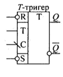
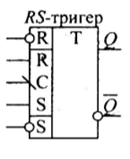
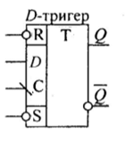
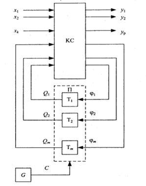
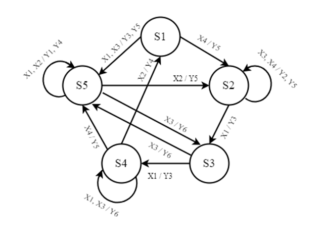
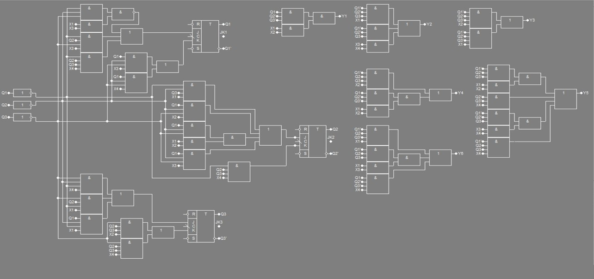

# Тема: Проектування та дослідження автомата Мілі

## 📘 Теоретичні відомості

Цифровий автомат із пам’яттю — це послідовна схема, що здійснює перетворення двійкових змінних. Такі схеми мають два і більше станів, на відміну від комбінаційних схем, які мають тільки один стан.

Цифрові автомати розглядаються на:
- Абстрактному рівні — описується взаємодія з зовнішнім середовищем без урахування внутрішньої організації.
- Структурному рівні — розглядається як взаємодія з середовищем, так і внутрішня організація.

> Відповідно, розрізняють **абстрактні** та **структурні** автомати.

### 📐 Абстрактна модель автомата

Абстрактний автомат задається п’ятіркою: A = (X, Y, Z, δ, λ)

де:
- `X = {Xᵢ | i = 1..n}` — вхідний алфавіт  
- `Y = {Yᵢ | i = 1..k}` — вихідний алфавіт  
- `Z = {Zᵢ | i = 1..s}` — алфавіт внутрішніх станів  
- `δ` — функція переходів  
- `λ` — функція виходів  

Якщо множини `X`, `Y`, `Z` є кінцевими, такий автомат називається **кінцевим автоматом**.

На абстрактному рівні алфавіти складаються з абстрактних символів, а на структурному — кожному символу відповідає вектор структурних сигналів.

### 🔄 Функції переходів і виходів

Функція переходів визначає спосіб переходу автомата з одного стану в інший,  
а функція виходів — спосіб формування вихідних сигналів.

Існують два основні різновиди автоматів, що відрізняються способом формування вихідних сигналів:

#### 🟦 Автомат Мура:

- Вихідні сигнали залежать тільки від поточного стану:
  
Zᵢ^(t+1) = δ(Xⱼ^t, Zₛ^t)

Yᵢ^t = λ(Zₛ^t)

#### 🟨 Автомат Мілі:

- Вихідні сигнали залежать від поточного стану та вхідного сигналу:
  
Zᵢ^(t+1) = δ(Xⱼ^t, Zₛ^t)

Yᵢ^t = λ(Xⱼ^t, Zₛ^t)

> 📌 Індекс `t` — це момент автоматного часу (`t = 1, 2, 3, ...`).

### 🧩 Подання автомата

Функції переходів і виходів можуть бути задані:

1. **Графом автомата**
2. **Таблицями переходів і виходів**

#### 📌 Граф автомата

- Орієнтований граф, де вершини — стани автомата `Zᵢ`, `Zⱼ`,  
а дуги — переходи між ними.
- Дуга (Zj, Zi) означає перехід від стану `Zj` до `Zi`.
- Кожній дузі приписується вхідний символ (умова переходу).

#### 📋 Таблиці переходів і виходів

- **Автомат Мілі**:
  - У таблиці переходів: вказується новий стан.
  - У таблиці виходів: вказується відповідний вихідний сигнал.

- **Автомат Мура**:
  - Вихід залежить тільки від стану → одна відмічена таблиця.
  - У заголовку кожного стовпця: стан `Zi` та відповідний вихід `Yi`.

🔁 **Між графом і таблицями існує однозначна відповідність**  
Можна легко перейти від графа до таблиць — і навпаки.

## 🧠 Абстрактний синтез автоматів з пам'яттю

Синтез цифрових автоматів виконується у два етапи:

1. **Абстрактний синтез**
2. **Структурний синтез**

### 📐 Абстрактний синтез

Результатом абстрактного синтезу є формальний опис автомата у вигляді п’ятірки: A = (X, Y, Z, S, A)

### 🔄 Етапи абстрактного синтезу:

- Формування **вхідного алфавіту** та **вихідного алфавітів**;
- Складання **алгоритму функціонування автомата**
- Формування **алфавіту внутрішніх станів** 
- Визначення **функцій переходів** та **виходів** (через граф або таблиці)

### ⌨️ Вхідний алфавіт

Формується на основі зовнішніх сигналів, які впливають на режим роботи автомата.  
Різні комбінації цих сигналів визначають букви `Xᵢ` вхідного алфавіту.

## ⚙️ Алгоритм функціонування цифрового автомата

Автомат, як правило, **здійснює управління операційним пристроєм**, який виконує перетворення цифрової інформації через певні оператори.  
Кожному оператору відповідає **набір керуючих сигналів**, який на абстрактному рівні розглядається як буква `Yᵢ` вихідного алфавіту.

### 🧩 Формування алгоритму

Отримання **алгоритму функціонування автомата** — неформалізований процес, що вимагає розуміння способу перетворення інформації.

Для опису використовують:

- **Графічні схеми алгоритмів (ГСА)**
- **Логічні (лінійні) схеми алгоритмів (ЛСА)**

### 🗺️ Граф як формальний опис

Після створення ГСА можливо формалізувати побудову графа автомата та визначити алфавіт внутрішніх станів.

> Таким чином, ГСА, як і граф переходів, можуть розглядатися як формальний опис абстрактного автомата.

### 🧭 Розмітка станів

Під час побудови графа автомата виконується розмітка станів на основі ГСА.  
Методи розмітки відрізняються для автоматів Мура і Мілі.

## 🔧 Структурний синтез автомата методом композиції тригерів

Результати **абстрактного синтезу** автомата можуть слугувати вихідними даними для **структурного синтезу**.  
Якщо абстрактний автомат є математичною моделлю пристрою, то структурний автомат визначає **логічну організацію пристрою** з урахуванням заданого елементного базису та вхідних/вихідних сигналів.

### ⚠️ Коригування результатів абстрактного синтезу

Під час проектування реальних систем може виникнути потреба коригувати **результати абстрактного синтезу** (наприклад, ГСА чи граф автомата) з метою:

- Усунення ризиків збою
- Врахування тривалості структурних сигналів
- Вибору елементної бази

Це коригування може привести до **введення нових вершин і дуг** в граф автомату, що змінює множину станів абстрактного автомата `{Z₁, Z₂, ..., Zn}` на множину станів структурного автомата `{z₁, z₂, ..., zk}`.

### 🛠️ Композиція тригерів

Одним із підходів до **структурного синтезу** є представлення автомата у вигляді **композиції тригерів**. Існують чотири основні типи тригерів:

- **RS-тригери**
- **JK-тригери**
- **D-тригери**
- **T-тригери**

Тригери мають лише два стани:

- Нульовий стан: Q = 0, ¬Q = 1

- Одиничний стан: Q = 1, ¬Q = 0

Перехід тригерів між станами визначається **інформаційними сигналами**, а момент переходу визначається перепадом синхросигналу \( C \) (наприклад, перепад з 1 в 0).

Асинхронні входи тригерів **R** та **S** дозволяють **встановлювати початковий стан** тригерів.

Рисунок 10.1 Синхронні тригери:

   

📊 **Таблиця 10.1 - Таблиця системи підграфів переходів**

|      | J | K | T | R | S | D |
|------| - | - | - | - | - | - |
|0 -> 0| 0 | * | 0 | * | 0 | 0 |
|0 -> 1| 1 | * | 1 | 0 | 1 | 1 |
|1 -> 0| * | 1 | 1 | 1 | 0 | 0 |
|1 -> 1| * | 0 | 0 | 0 | * | 1 |

## Узагальнена структура автомата

Автомат будується за методом **композиції елементарних автоматів** (тригерів):

- Складається з:
  
  - **Комбінаційної схеми (КС)**
    
  - **Пам’яті (П)**, реалізованої тригерами
    
- Входами КС є:
  
  - Виходи тригерів
    
  - Вхідні структурні сигнали (логічні умови)
    
- Виходи КС:
  
  - **Керуючі сигнали**
    
  - **Функції збудження тригерів**
    
- **Стан автомата** визначається комбінацією значень тригерів
- Перехід між станами здійснюється **синхронно**, під дією сигналу `C` від генератора `G`

> 📌 Синхронність забезпечує точне перемикання між станами без помилок.

Рисунок  10.2 Структурна схема цифрового автомата

### 🔧 Етапи синтезу синхронного автомата
Синтез синхронного автомата виконується поетапно:

1. Складання списку структурних вихідних сигналів, що відповідають кожній букві вихідного алфавіту абстрактного автомата.

2. Визначення тривалості кожного вихідного сигналу (у кількості тактів) і періоду тактуючих сигналів автомата.

3. Отримання закодованої ГСА структурного автомата — за потреби виконується корекція абстрактної ГСА, якщо сигнали мають різну тривалість.

4. Розмітка ГСА структурного автомата.

5. Складання графа структурного автомата.

6. Кодування станів структурного автомата.

7. Складання структурної таблиці автомата.

8. Отримання МДНФ (мінімальних диз'юнктивних нормальних форм) функцій збурення тригерів і керуючих сигналів.

9. Представлення функцій збурення тригерів і керуючих сигналів в операторній формі.

10. Побудова логічної схеми керуючого автомата.

## 🧪 Хід роботи

### 🔢 Вхідні дані

**Коди стану керуючого автомата:**  
`h₃ = 0`, `h₂ = 1`, `h₁ = 1`

### 📋 Таблиця 10.2 - Таблиця переходів

| Стан автомата | Х₁  | Х₂  | Х₃  | Х₄  |
|---------------|-----|-----|-----|-----|
| **S₁**        | S₅  | -   | S₅  | S₂  |
| **S₂**        | S₃  | -   | S₂  | S₂  |
| **S₃**        | S₄  | -   | S₅  | -   |
| **S₄**        | S₄  | S₁  | S₄  | S₅  |
| **S₅**        | S₅  | S₅  | S₃  | S₂  |

### 📤 Таблиця 10.3 - Таблиця виходів

| Стан автомата | Х₁  | Х₂  | Х₃  | Х₄  |
|---------------|-----|-----|-----|-----|
| **S₁**        | Y₃  | -   | Y₅  | Y₅  |
| **S₂**        | Y₂  | -   | Y₂  | Y₅  |
| **S₃**        | Y₃  | -   | Y₆  | -   |
| **S₄**        | Y₆  | Y₄  | Y₆  | Y₅  |
| **S₅**        | Y₁  | Y₄  | Y₆  | Y₅  |

**Тип тригера: Jk**

### 📈 Побудова графа автомата

Рисунок. 10.1. - Граф автомата

Для побудови таблиці кодування станів автомата Мілі, де кожному стану присвоєно унікальний код, використовуються тригери для збереження стану автомата. Оскільки необхідно зберігати 5 різних станів, мінімальна кількість тригерів для цього складає 3, що відповідає $\lceil \log_2{5} \rceil = 3$

### Таблиця кодування станів автомата Мілі

| Стан | Q1 | Q2 | Q3 |
|------|----|----|----|
| S1   | 0  | 0  | 0  |
| S2   | 0  | 0  | 1  |
| S3   | 0  | 1  | 0  |
| S4   | 0  | 1  | 1  |
| S5   | 1  | 0  | 0  |

### 📊 Таблиця 10.4. Структурна таблиця автомата Мілі

| ПС  | Код ПС|    |    | СП | Код СП |      |      | Логічна умова |    |    |    | Керуючі сигнали |    |    |    |    |    | Функції збурення тригерів |    |    |    |    |    |
| --- | ----- | -- | -- | -- | ------ | ---- | ---- | ------------- | -- | -- | -- | --------------- | -- | -- | -- | -- | -- | ------------------------- | -- | -- | -- | -- | -- |
|     | Q₁ˢ   | Q₂ˢ| Q₃ˢ|    | Q₁ˢ⁺¹  | Q₂ˢ⁺¹| Q₃ˢ⁺¹| x₁            | x₂ | x₃ | x₄ | y₁              | y₂ | y₃ | y₄ | y₅ | y₆ | J₁                        | K₁ | J₂ | K₂ | J₃ | K₃ |
| S₁  | 0     | 0  | 0  | S₅ | 1      | 0    | 0    | 1             | -  | 1  | -  | 0               | 0  | 1  | 0  | 1  | 0  | 1                         | *  | 0  | *  | 0  | *  |
| S₁  | 0     | 0  | 0  | S₂ | 0      | 0    | 1    | -             | -  | -  | 1  | 0               | 0  | 0  | 0  | 1  | 0  | 0                         | *  | 0  | *  | 1  | 0  |
| S₂  | 0     | 0  | 1  | S₃ | 0      | 1    | 1    | 1             | -  | -  | -  | 0               | 1  | 0  | 0  | 0  | 0  | 0                         | *  | 1  | *  | *  | 0  |
| S₂  | 0     | 0  | 1  | S₂ | 0      | 0    | 1    | -             | -  | 1  | 1  | 0               | 1  | 0  | 0  | 1  | 0  | 0                         | *  | 0  | *  | *  | 0  |
| S₃  | 0     | 1  | 0  | S₄ | 0      | 1    | 1    | 1             | -  | -  | -  | 0               | 0  | 1  | 0  | 0  | 0  | 0                         | *  | *  | 0  | 1  | *  |
| S₃  | 0     | 1  | 0  | S₅ | 1      | 0    | 0    | -             | -  | 1  | 0  | 0               | 0  | 0  | 0  | 0  | 1  | 1                         | *  | *  | 0  | 0  | *  |
| S₄  | 0     | 1  | 1  | S₄ | 0      | 1    | 1    | 1             | -  | 1  | -  | 0               | 0  | 0  | 0  | 0  | 1  | 0                         | *  | *  | 0  | *  | 0  |
| S₄  | 0     | 1  | 1  | S₁ | 0      | 0    | 0    | -             | 1  | -  | -  | 0               | 0  | 0  | 1  | 0  | 0  | 0                         | *  | 1  | *  | *  | 1  |
| S₄  | 0     | 1  | 1  | S₅ | 1      | 0    | 0    | -             | -  | -  | 1  | 0               | 0  | 0  | 0  | 1  | 0  | 1                         | *  | *  | 1  | *  | 1  |
| S₅  | 1     | 0  | 0  | S₅ | 1      | 0    | 0    | 1             | 1  | -  | -  | 1               | 0  | 0  | 1  | 0  | 0  | *                         | 0  | 1  | *  | 0  | *  |
| S₅  | 1     | 0  | 0  | S₃ | 0      | 1    | 0    | -             | -  | 1  | -  | 0               | 0  | 0  | 0  | 0  | 1  | *                         | 1  | 1  | *  | 0  | *  |
| S₅  | 1     | 0  | 0  | S₂ | 0      |      | 1    | -             | -  | -  | 1  | 0               | 0  | 0  | 0  | 1  | 0  | *                         | 1  | 0  | *  | 1  | *  |

> ***ПС - початковий стан, СП — стан переходу**

### МДНФ функцій керуючих сигналів

y₁ = Q₁Q̅₂Q̅₃x₁x₂  
y₂ = Q̅₁Q̅₂Q₃x₁ ∨ Q̅₁Q̅₂Q₃x₃x₄  
y₃ = Q̅₁Q̅₂Q̅₃x₁x₃ ∨ Q̅₁Q₂Q̅₃x₁  
y₄ = Q̅₁Q₂Q₃x₂ ∨ Q₁Q̅₂Q̅₃x₁x₂  
y₅ = Q̅₁Q̅₂Q̅₃x₁x₂ ∨ Q̅₂Q̅₃x₄ ∨ Q̅₁Q̅₂Q₃x₃x₄ ∨ Q̅₁Q₂Q₃x₄ ∨ Q₁Q̅₂Q̅₃x₄  
y₆ = Q̅₁Q₂Q̅₃x₁ ∨ Q̅₁Q₂Q₃x₁x₃ ∨ Q₁Q̅₂Q̅₃x₄

### МДНФ функцій збурення тригерів

J₁ = Q̅₁Q̅₂Q̅₃x₁x₃ ∨ Q̅₁Q₂Q̅₃x₃ ∨ Q̅₁Q₂Q₃x₄  
K₁ = Q₁Q̅₂Q̅₃x₃ ∨ Q₁Q̅₂Q̅₃x₄  

J₂ = Q̅₁Q̅₂Q₃x₁ ∨ Q₁Q̅₂Q̅₃x₂ ∨ Q₁Q̅₂Q̅₃x₁x₂ ∨ Q₁Q̅₂Q̅₃x₃  
K₂ = Q̅₁Q₂Q₃x₄  

J₃ = Q̅₁Q̅₂Q̅₃x₄ ∨ Q̅₁Q₂Q̅₃x₁ ∨ Q₁Q̅₂Q̅₃x₁  
K₃ = Q̅₁Q₂Q₃x₂ ∨ Q̅₁Q₂Q₃x₄

### Рисунок. 10.2. Функціональні схеми цифрового автомата

## Використане програмне забезпечення

Для побудови та аналізу комбінаційних схем та канонічних форм булевих функцій було використано програму AFDK.
