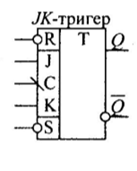

# Тема: Проектування та дослідження автомата Мілі

## 📘 Теоретичні відомості

Цифровий автомат із пам’яттю — це послідовна схема, що здійснює перетворення двійкових змінних. Такі схеми мають два і більше станів, на відміну від комбінаційних схем, які мають тільки один стан.

Цифрові автомати розглядаються на:
- Абстрактному рівні — описується взаємодія з зовнішнім середовищем без урахування внутрішньої організації.
- Структурному рівні — розглядається як взаємодія з середовищем, так і внутрішня організація.

> Відповідно, розрізняють **абстрактні** та **структурні** автомати.

### 📐 Абстрактна модель автомата

Абстрактний автомат задається п’ятіркою: A = (X, Y, Z, δ, λ)

де:
- `X = {Xᵢ | i = 1..n}` — вхідний алфавіт  
- `Y = {Yᵢ | i = 1..k}` — вихідний алфавіт  
- `Z = {Zᵢ | i = 1..s}` — алфавіт внутрішніх станів  
- `δ` — функція переходів  
- `λ` — функція виходів  

Якщо множини `X`, `Y`, `Z` є кінцевими, такий автомат називається **кінцевим автоматом**.

На абстрактному рівні алфавіти складаються з абстрактних символів, а на структурному — кожному символу відповідає вектор структурних сигналів.

### 🔄 Функції переходів і виходів

Функція переходів визначає спосіб переходу автомата з одного стану в інший,  
а функція виходів — спосіб формування вихідних сигналів.

Існують два основні різновиди автоматів, що відрізняються способом формування вихідних сигналів:

#### 🟦 Автомат Мура:

- Вихідні сигнали залежать тільки від поточного стану:
  
Zᵢ^(t+1) = δ(Xⱼ^t, Zₛ^t)

Yᵢ^t = λ(Zₛ^t)

#### 🟨 Автомат Мілі:

- Вихідні сигнали залежать від поточного стану та вхідного сигналу:
  
Zᵢ^(t+1) = δ(Xⱼ^t, Zₛ^t)

Yᵢ^t = λ(Xⱼ^t, Zₛ^t)

> 📌 Індекс `t` — це момент автоматного часу (`t = 1, 2, 3, ...`).

### 🧩 Подання автомата

Функції переходів і виходів можуть бути задані:

1. **Графом автомата**
2. **Таблицями переходів і виходів**

#### 📌 Граф автомата

- Орієнтований граф, де вершини — стани автомата `Zᵢ`, `Zⱼ`,  
а дуги — переходи між ними.
- Дуга (Zj, Zi) означає перехід від стану `Zj` до `Zi`.
- Кожній дузі приписується вхідний символ (умова переходу).

#### 📋 Таблиці переходів і виходів

- **Автомат Мілі**:
  - У таблиці переходів: вказується новий стан.
  - У таблиці виходів: вказується відповідний вихідний сигнал.

- **Автомат Мура**:
  - Вихід залежить тільки від стану → одна відмічена таблиця.
  - У заголовку кожного стовпця: стан `Zi` та відповідний вихід `Yi`.

🔁 **Між графом і таблицями існує однозначна відповідність**  
Можна легко перейти від графа до таблиць — і навпаки.

## 🧠 Абстрактний синтез автоматів з пам'яттю

Синтез цифрових автоматів виконується у два етапи:

1. **Абстрактний синтез**
2. **Структурний синтез**

### 📐 Абстрактний синтез

Результатом абстрактного синтезу є формальний опис автомата у вигляді п’ятірки: A = (X, Y, Z, S, A)

### 🔄 Етапи абстрактного синтезу:

- Формування **вхідного алфавіту** та **вихідного алфавітів**;
- Складання **алгоритму функціонування автомата**
- Формування **алфавіту внутрішніх станів** 
- Визначення **функцій переходів** та **виходів** (через граф або таблиці)

### ⌨️ Вхідний алфавіт

Формується на основі зовнішніх сигналів, які впливають на режим роботи автомата.  
Різні комбінації цих сигналів визначають букви `Xᵢ` вхідного алфавіту.

## ⚙️ Алгоритм функціонування цифрового автомата

Автомат, як правило, **здійснює управління операційним пристроєм**, який виконує перетворення цифрової інформації через певні оператори.  
Кожному оператору відповідає **набір керуючих сигналів**, який на абстрактному рівні розглядається як буква `Yᵢ` вихідного алфавіту.

### 🧩 Формування алгоритму

Отримання **алгоритму функціонування автомата** — неформалізований процес, що вимагає розуміння способу перетворення інформації.

Для опису використовують:

- **Графічні схеми алгоритмів (ГСА)**
- **Логічні (лінійні) схеми алгоритмів (ЛСА)**

### 🗺️ Граф як формальний опис

Після створення ГСА можливо формалізувати побудову графа автомата та визначити алфавіт внутрішніх станів.

> Таким чином, ГСА, як і граф переходів, можуть розглядатися як формальний опис абстрактного автомата.

### 🧭 Розмітка станів

Під час побудови графа автомата виконується розмітка станів на основі ГСА.  
Методи розмітки відрізняються для автоматів Мура і Мілі.

## 🔧 Структурний синтез автомата методом композиції тригерів

Результати **абстрактного синтезу** автомата можуть слугувати вихідними даними для **структурного синтезу**.  
Якщо абстрактний автомат є математичною моделлю пристрою, то структурний автомат визначає **логічну організацію пристрою** з урахуванням заданого елементного базису та вхідних/вихідних сигналів.

### ⚠️ Коригування результатів абстрактного синтезу

Під час проектування реальних систем може виникнути потреба коригувати **результати абстрактного синтезу** (наприклад, ГСА чи граф автомата) з метою:

- Усунення ризиків збою
- Врахування тривалості структурних сигналів
- Вибору елементної бази

Це коригування може привести до **введення нових вершин і дуг** в граф автомату, що змінює множину станів абстрактного автомата `{Z₁, Z₂, ..., Zn}` на множину станів структурного автомата `{z₁, z₂, ..., zk}`.

### 🛠️ Композиція тригерів

Одним із підходів до **структурного синтезу** є представлення автомата у вигляді **композиції тригерів**. Існують чотири основні типи тригерів:

- **RS-тригери**
- **JK-тригери**
- **D-тригери**
- **T-тригери**

Тригери мають лише два стани:

- Нульовий стан: Q = 0, ¬Q = 1

- Одиничний стан: Q = 1, ¬Q = 0

Перехід тригерів між станами визначається **інформаційними сигналами**, а момент переходу визначається перепадом синхросигналу \( C \) (наприклад, перепад з 1 в 0).

Асинхронні входи тригерів **R** та **S** дозволяють **встановлювати початковий стан** тригерів.

Рисунок 10.1 Синхронні тригери:

   

cистема підграфів переходів

|      | J | K | T | R | S | D |
|------| - | - | - | - | - | - |
|0 -> 0| 0 | * | 0 | * | 0 | 0 |
|0 -> 1| 1 | * | 1 | 0 | 1 | 1 |
|1 -> 0| * | 1 | 1 | 1 | 0 | 0 |
|1 -> 1| * | 0 | 0 | 0 | * | 1 | 
